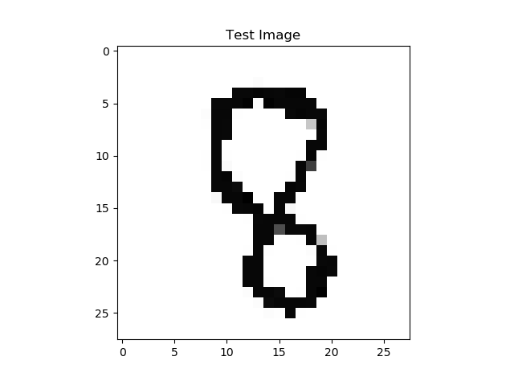

# AirDraw-n-Match-A-Webcam-Paint-Digit-Recognition-Program

A program where you can draw something without a keyboard or a mouse. It does not end here, it will give a random integer to draw, the Neural Network will predict the digit that you drew. The whole program works like a game.

## Achievements
- **One of the winners in Skill Showcasing - R@D!X (Radix) by Brac University Computer Club** 


## How to use


In the first detection panel, you will see a text saying, "Draw: 9". The number "9" is randomly generated, and you have to draw "9" on the canvas.
As I've coded the 'object' as a green bottle-cap, there will be a text at the top of the webcam saying, "Object Found". There will be another text at the lower region of the detection panel where it shows the object's area. The larger the area is, the larger the pen size will be. To increase or decrease the pen-size you will have to bring the green object closer to the webcam (to increase) or take further from the webcam (to decrease).


Draw by moving the green object, it is quite hard at the beginning but gets easier eventually.
Press 'q' to stop the video and then the output image will be analyzed using the MNIST data set to predict the digit that you have drawn. 
If the prediction and the given number "Draw: 9" matches, you will get a point.


You can either continue or close the program. Clicking the Continue button will run the 'webcam paint' again and increase the trial number.
The result panel shows the given number (randomly generated) and the prediction of your drawing and your achieved points with the trials.

## Code Explanation
```python
import tensorflow as tf
import numpy as np
import matplotlib.pyplot as plt
import cv2
import random
import easygui
```
Install all required modules and import them. 

### Digit Recognition
```python
mnist = tf.keras.datasets.mnist #28*28 image of handwritten of 0-9 
(x_train, y_train),(x_test,y_test) = mnist.load_data()

x_train = tf.keras.utils.normalize(x_train, axis = 1)
x_test = tf.keras.utils.normalize(x_test,axis = 1)

model = tf.keras.models.Sequential()
model.add(tf.keras.layers.Flatten()) 
model.add(tf.keras.layers.Dense(128,activation=tf.nn.relu))
model.add(tf.keras.layers.Dense(128,activation=tf.nn.relu))
model.add(tf.keras.layers.Dense(10,activation=tf.nn.softmax)) # softmax for probability distribution
model.compile(optimizer = "adam" , loss = 'sparse_categorical_crossentropy' , metrics = ['accuracy'] )
model.fit(x_train,y_train,epochs = 3 )
predictions = model.predict([x_test])
```
We used the MNIST data set, it has 70,000 images of handwritten images in 28 by 28 pixels.
We will use 60,000 images to train the model and the rest 10,000 to test the model.
We can see we used some methods here,

Sequential: That defines a SEQUENCE of layers in the neural network.

Flatten: Remember earlier where our images were a square, when you printed them out? Flatten just takes that square and turns it into a 1 dimensional set.

Dense: Adds a layer of neurons.

Relu effectively means "If X>0 return X, else return 0" -- so what it does it it only passes values 0 or greater to the next layer in the network.

Softmax takes a set of values, and effectively picks the biggest one.

The next thing to do, now the model is defined, is to actually build it. You do this by compiling it with an optimizer and loss function as before -- and then you train it by calling *model.fit * asking it to fit your training data to your training labels.

### Webcam Paint
```python
trials=0
points=0
```
Before we start our Webcam Paint portion, we have to create two variables 'trials' and 'points'.
```python
# random number generator
n=random. randint(0,9) 
num= 'Draw: '+str(n)

# capturing video
cap = cv2.VideoCapture(0) 

# choosing object color
low_green = np.array([20, 85, 70])
high_green = np.array([102, 255, 255])

# creating an image to draw 
img=np.zeros((512,512,3),np.int8)

# choosing the pen color
pen_color=(256,256,256)   

# 'trials' increases whenever it enters the outer loop
trials+=1
```

So, to show the "Draw: 9" on the detection panel we have to create a random number generator. Here, in random.randint, the arguments are set to 0 to 9 so that it can only generate integers from 0 to 9. The 'num' is a string data to use on the detection panel.
To capture a video, you need to create a VideoCapture object. Its argument can be either the device index or the name of a video file. Device index is just the number to specify which camera. Normally one camera will be connected (as in my case). So I simply pass 0 (or -1). You can select the second camera by passing 1 and so on. After that, you can capture frame-by-frame. But at the end, don’t forget to release the capture.
Choose a color range (threshold value) for the colored object detection.
For details, [Check this out](https://www.geeksforgeeks.org/python-thresholding-techniques-using-opencv-set-1-simple-thresholding/).

In the inner loop,
```python
cv2.imshow('Canvas',img)
ret, frame = cap.read()
frame = cv2.flip(frame,1)
hsv = cv2.cvtColor(frame, cv2.COLOR_BGR2HSV)
mask = cv2.inRange(hsv, low_green , high_green)
contours, hierarchy = cv2.findContours(mask, cv2.RETR_EXTERNAL, cv2.CHAIN_APPROX_SIMPLE)
cv2.putText(frame, num, (20, 80), cv2.FONT_HERSHEY_COMPLEX, 0.7, (255,10,0), 1, cv2.LINE_AA)
```
Show the created image 'img' and name it 'Canvas'. 
cap.read() returns a bool (True/False). If frame is read correctly, it will be True. So you can check end of the video by checking this return value.
Mirror the image using cv2.flip(frame,1) to draw with ease. 
Convert color to hsv and then create a mask with the threshold value (low_green, high_green) to detect the object.
Use cv2.findContours to show the detected green object. Contours can be explained simply as a curve joining all the continuous points (along the boundary), having same color or intensity. The contours are a useful tool for shape analysis and object detection and recognition.
I used cv2.putText to show the 'Draw: 9' to see which number the user have to draw.


```python
for c in contours:
        area = cv2.contourArea(c)
        if area > 600:
            x, y, w, h = cv2.boundingRect(c)
            cv2.rectangle(frame, (x, y), (x+w, y+h), (255,10,0), 2)
            pen_size=2
            if  1500 < area <2500:
                pen_size=3
            elif 2500 < area<3500:
                pen_size=4
            elif 3500 < area <4500:
                 pen_size=5
            elif 4500 < area<5500:
                 pen_size=6
            elif 5500 < area<6500:
                 pen_size=7
            elif 6500 < area < 7500:
                 pen_size=8
            elif 7500 < area < 8500:
                 pen_size=9
            elif 8500 < area:
                 pen_size=10
            cv2.circle(img,(x,y),pen_size,pen_color,-1)
            cv2.circle(frame,(x,y),pen_size,pen_color,2)
            cv2.putText(frame, "Object Found", (250, 80), cv2.FONT_HERSHEY_COMPLEX, 0.8, (255,10,0), 1, cv2.LINE_AA)
            cv2.putText(frame, str(area), (250, 400), cv2.FONT_HERSHEY_COMPLEX, 0.5, (255,10,0), 1, cv2.LINE_AA)          
```
For each countours, we will use the cv2.contourArea to get the area of the countor. If the area is greater than 60 it will create a bounding box. Moreover, the pensize depends on the area of the countour. 
After the last elif we draw circles on the 'Canvas' according to the value of 'x' and 'y'. We also add a circle on the detection panel which works as a nib.
At last, in the for loop we write some texts like "Object Found" and the area of the object.
```python
cv2.imshow('Detection Panel', frame)
if cv2.waitKey(10) == ord('q'):
    break  
```
To see the detection panel I used cv2.imshow('Detection Panel', frame).
To close the Webcam Paint program or stop the video capturing we have to press 'q', which breaks the whole loop.
```python
cv2.imwrite("Output Image.jpg",img)
cap.release()
cv2.destroyAllWindows()
```
To finish the Webcam Paint section we'll realease the capture. We can save the output image using cv2.imwrite.

### Merging Webcam Paint & Digit Recognition (predicting the digit)
```python
image = cv2.imread("Output Image.jpg")
image = image[25:420, 25:450]
image = ~image
cv2.imwrite("img_inv.jpg",image)
```
Crop the image and invert the color.
```python
img_array = cv2.imread("img_inv.jpg", cv2.IMREAD_GRAYSCALE)
img_array = cv2.bitwise_not(img_array)
img_size = 28
new_array = cv2.resize(img_array, (img_size,img_size))
plt.imshow(new_array, cmap = plt.cm.binary)
plt.title("Test Image")
plt.show()
```
Changing the image shape to 28 * 28 and turning it into a grayscale image. The image below shows how the test image looks like.


```python
user_test = tf.keras.utils.normalize(new_array, axis = 1)
predicted = model.predict([[user_test]])
a = predicted[0][0]
for i in range(0,10):
    b = predicted[0][i]
    print("Probability Distribution for",i,b)
print("The Predicted Value is",np.argmax(predicted[0]))
```
Finally, we will predict the drawn digit. You'll notice that all of the values in the number are between 0 and 255. If we are training a neural network, for various reasons it's easier if we treat all values as between 0 and 1, a process called 'normalizing'. We will normalize the 'new_array' which is the array of the test image. Then, we will predict the digit; we will also print out the probability distribution. The one with the highest probability distribution is our predicted digit.

### Result
```python
draw=str(n)
    prediction=str(np.argmax(predicted[0]))
    if n==np.argmax(predicted[0]):
        points+=1
        message="Given number was: "+draw+"\nPredicted number is: "+prediction+"\n\nYour number matched!!!\n\nPoints: "+str(points)+"\n\nTrials: "+str(trials)       
        permission = easygui.buttonbox(message, 'Result', choices=(['Close', 'Continue']))
    else:
        message="Given number was: "+draw+"\nPredicted number is: "+prediction+"\n\nYour number didn't match!!!\n\nPoints: "+str(points)+"\n\nTrials: "+str(trials)
        permission = easygui.buttonbox(message, 'Result', choices=(['Close', 'Continue']))         
    if permission!='Continue':
        break
```
The result panel shows up when you press q. It will show the given number and the predicted number along with your achievec points and trials.
The 'permission' variable is a string data which comes from the easygui button. It can be 'Close' or 'Continue'.
The whole loop (first while loop) will break if the 'permission' variable's value is not 'Continue'.
So, this is how the program ends.

## Optional way to run the Webcam Paint (Object Tracking)
It's not a convinient way to draw because, keeping the track of a selected object is not optimal. So, the object gets lost. But it's not advised for webcam paint.
For the code, [Check this out](https://github.com/farhad324/AirDraw-n-Match-A-Webcam-Paint-Digit-Recognition-Program/blob/master/Webcam%20paint%20using%20ROI%20select.py).

